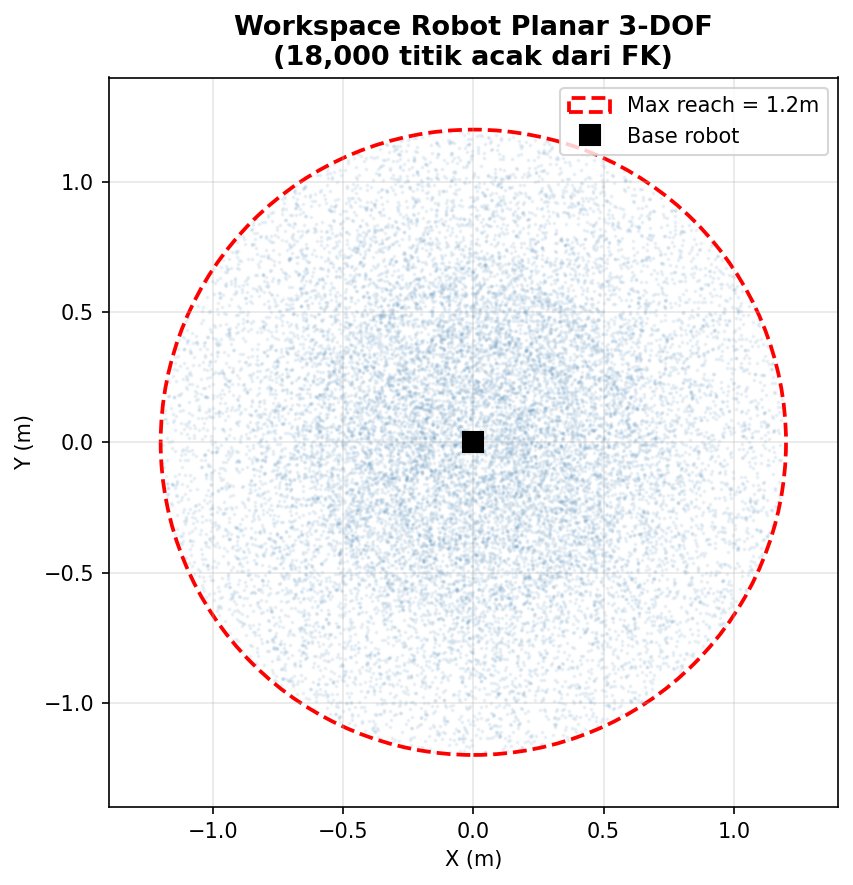
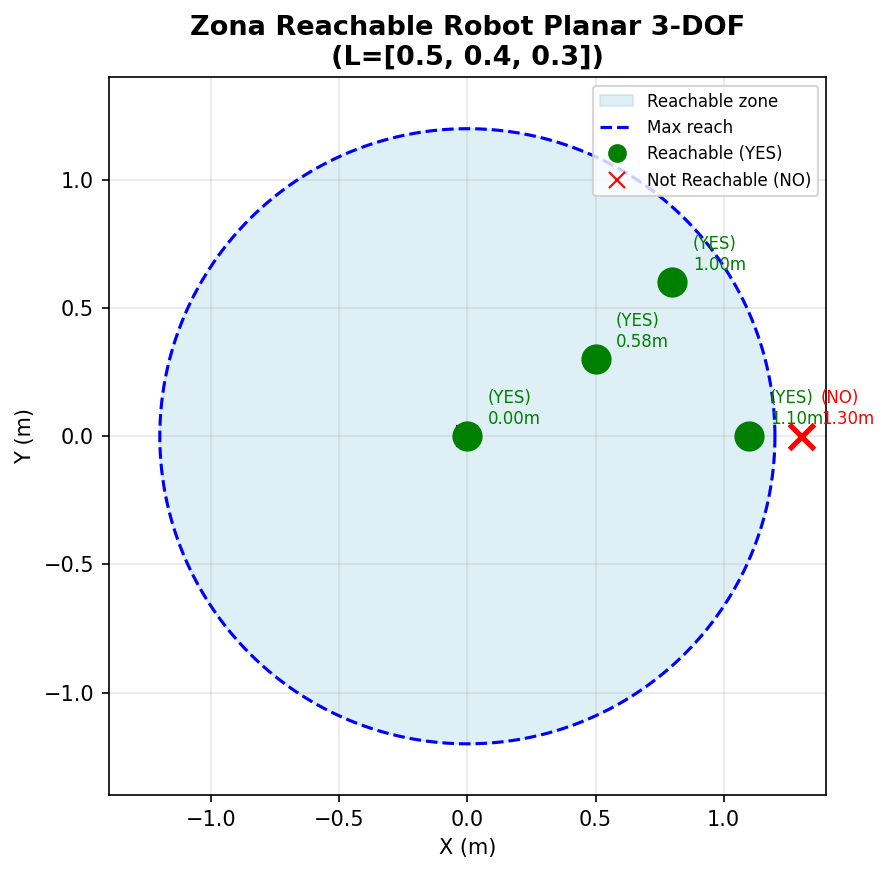
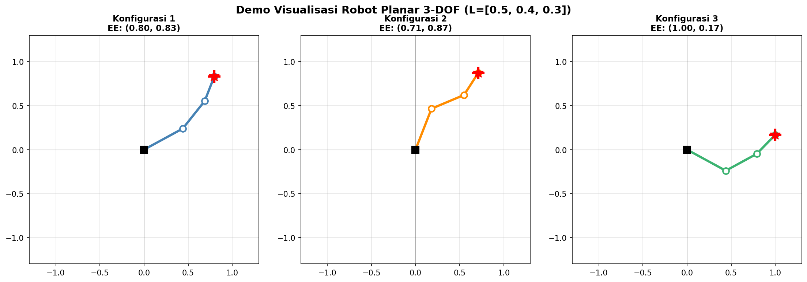

# 🦾 Inverse Kinematics Planar Robot 3-DOF

### Pendekatan Machine Learning & Deep Learning

> **Nama:** Sistra Amanda Sinaga
> **NIM:** 42223O1O11
> **Mata Kuliah:** Praktikum Kinematika dan Kontrol Robot — IK ML / DL

---

# 📌 Deskripsi Proyek

Repositori ini berisi implementasi penyelesaian masalah **Inverse Kinematics (IK)** pada robot planar **3 Degrees of Freedom (3-DOF)** menggunakan pendekatan **Machine Learning (ML)** dan **Deep Learning (DL)**.

Tujuan utama proyek ini adalah mempelajari bagaimana model pembelajaran mesin dapat memprediksi sudut sendi robot berdasarkan posisi target end-effector secara cepat dan akurat tanpa menyelesaikan persamaan IK secara analitik setiap saat.

---

# 🔍 Apa itu Inverse Kinematics?

| Aspek             | Forward Kinematics (FK) | Inverse Kinematics (IK) |
| ----------------- | ----------------------- | ----------------------- |
| Input             | θ₁, θ₂, θ₃              | x, y                    |
| Output            | x, y                    | θ₁, θ₂, θ₃              |
| Tingkat Kesulitan | Mudah                   | Lebih Sulit             |
| Jumlah Solusi     | Umumnya unik            | Bisa banyak solusi      |

### Persamaan Forward Kinematics

```math
x = L1 cos(θ1) + L2 cos(θ1+θ2) + L3 cos(θ1+θ2+θ3)
```

```math
y = L1 sin(θ1) + L2 sin(θ1+θ2) + L3 sin(θ1+θ2+θ3)
```

---

# 🤖 Spesifikasi Robot

| Parameter          | Nilai       |
| ------------------ | ----------- |
| Link 1 (L1)        | 0.5 m       |
| Link 2 (L2)        | 0.4 m       |
| Link 3 (L3)        | 0.3 m       |
| Total DOF          | 3           |
| Batas Sudut        | -π hingga π |
| Jangkauan Maksimum | 1.2 m       |

```text
Base ── Link1 ── Link2 ── Link3 ── End-Effector
        0.5 m     0.4 m     0.3 m
```

---

# 🛠️ Instalasi

Install seluruh library yang diperlukan:

```bash
pip install gymnasium stable-baselines3 scikit-learn torch matplotlib numpy pandas tqdm
```

---

# 📚 Library yang Digunakan

| Library           | Fungsi                     |
| ----------------- | -------------------------- |
| NumPy             | Operasi numerik            |
| Matplotlib        | Visualisasi                |
| Scikit-Learn      | Machine Learning           |
| PyTorch           | Deep Learning              |
| Pandas            | Pengolahan Data            |
| Gymnasium         | Environment RL             |
| Stable-Baselines3 | PPO Reinforcement Learning |

---

# 🗺️ Workspace & Geometri Robot

Setelah dimensi link diperbarui, robot memiliki jangkauan maksimum sebesar **1.2 meter**. Area kerja robot diperoleh menggunakan sampling Forward Kinematics sebanyak 18.000 data.

## Workspace Robot



**Gambar 1.** Workspace robot planar 3-DOF hasil sampling 18.000 data.

---

## Reachability Check



**Gambar 2.** Pemeriksaan apakah target masih berada dalam area jangkauan robot.

---

## Demo Visualisasi Robot



**Gambar 3.** Visualisasi konfigurasi robot planar 3-DOF.

---

# 📊 Dataset

Dataset dibuat menggunakan metode **Forward Kinematics Sampling**.

```python
N = 18000

theta ~ Uniform(-π, π)

ee_pos = FK(theta)
```

| Properti      | Nilai                |
| ------------- | -------------------- |
| Jumlah Sampel | 18.000               |
| Input         | (x, y)               |
| Output        | (θ1, θ2, θ3)         |
| Split Data    | 80% Train / 20% Test |
| Train Data    | 14.400               |
| Test Data     | 3.600                |
| Normalisasi   | StandardScaler       |

---

# 🤖 Metode Machine Learning

Tiga metode Machine Learning digunakan sebagai pembanding.

## 1. Extra Trees Regressor

Kelebihan:

* Cepat
* Robust terhadap noise
* Cocok untuk data non-linear

```python
ExtraTreesRegressor(
    n_estimators=150,
    max_features='sqrt',
    n_jobs=-1
)
```

---

## 2. Ridge Regression

Kelebihan:

* Sangat cepat
* Sederhana
* Mudah diinterpretasikan

```python
Ridge(alpha=1.0)
```

---

## 3. MLP Regressor

Neural Network bawaan Scikit-Learn.

```python
MLPRegressor(
    hidden_layer_sizes=(256,256),
    activation='relu',
    solver='adam'
)
```

---

# 🧠 Deep Learning — IKNet (PyTorch)

Model Deep Learning dirancang khusus untuk memprediksi sudut sendi robot.

## Arsitektur

```text
Input (x,y)

↓ Linear 2 → 256
↓ BatchNorm
↓ ReLU

↓ Linear 256 → 512
↓ BatchNorm
↓ ReLU
↓ Dropout

↓ Linear 512 → 512
↓ BatchNorm
↓ ReLU
↓ Dropout

↓ Linear 512 → 256
↓ BatchNorm
↓ ReLU

↓ Linear 256 → 3

Output = θ1 θ2 θ3
```

---

## Konfigurasi Training

| Parameter     | Nilai             |
| ------------- | ----------------- |
| Optimizer     | Adam              |
| Learning Rate | 0.001             |
| Scheduler     | CosineAnnealingLR |
| Epoch         | 100               |
| Batch Size    | 512               |
| Weight Decay  | 1e-5              |

---

## Mengapa Loss Cartesian?

Karena satu posisi target dapat memiliki lebih dari satu konfigurasi sudut.

Jika loss dihitung pada sudut:

```text
Prediksi Sudut ≠ Sudut Asli
```

padahal posisi end-effector bisa sama.

Oleh karena itu digunakan:

```text
Loss = Error Posisi End-Effector
```

yang lebih merepresentasikan performa fisik robot.

---

# 📈 Hasil Evaluasi

## Training Curve IKNet

.png)

**Gambar 4.** Kurva training dan validation loss selama 100 epoch.

---

## Perbandingan Error Machine Learning


**Gambar 5.** Distribusi error end-effector metode Machine Learning.

---

## Perbandingan Akurasi ML vs DL


**Gambar 6.** Perbandingan rata-rata error seluruh metode.

---

## Distribusi Error Semua Metode


**Gambar 7.** Analisis distribusi error seluruh metode.

---

# 🏆 Ringkasan Hasil

| Metode           | Kategori | Dataset | Kelebihan                |
| ---------------- | -------- | ------- | ------------------------ |
| Ridge Regression | ML       | Ya      | Training tercepat        |
| Extra Trees      | ML       | Ya      | Robust dan stabil        |
| MLP Regressor    | ML       | Ya      | Neural Network ringan    |
| IKNet            | DL       | Ya      | Akurasi tertinggi        |
| PPO              | RL       | Tidak   | Tidak memerlukan dataset |

---

# 🎯 Rekomendasi

| Kebutuhan             | Metode              |
| --------------------- | ------------------- |
| Training tercepat     | Ridge               |
| Akurasi ML terbaik    | Extra Trees         |
| Neural Network ringan | MLP                 |
| Akurasi terbaik       | IKNet               |
| Tanpa dataset         | PPO                 |
| Hardware rendah       | Ridge / Extra Trees |

---

# ▶️ Cara Menjalankan

```bash
pip install gymnasium stable-baselines3 scikit-learn torch matplotlib numpy pandas tqdm
```

Jalankan notebook:

```bash
jupyter notebook "Assignment IK ML, DL, RL.ipynb"
```

Urutan eksekusi:

1. Import Library
2. Konfigurasi Robot
3. Generate Dataset
4. Split Dataset
5. Training ML
6. Training DL
7. Evaluasi
8. Visualisasi

---

# 📁 Struktur Repository

```text
📦 Assignment IK ML, DL, RL
┣ 📓 Assignment IK ML, DL, RL.ipynb
┣ 📂 images
┃ ┣ 📷 workspace_robot_3dof.png
┃ ┣ 📷 Demo Visualisasi Robot.png
┃ ┣ 📷 Fungsi Reachability Check.png
┃ ┣ 📷 Training Curve — Deep Learning (IKNet).png
┃ ┣ 📷 Perbandingan Error End-Effector — Metode ML Baru.png
┃ ┣ 📷 Perbandingan Akurasi IK Baru — ML vs DL.png
┃ ┗ 📷 Analisis Distribusi Error End-Effector — Semua Metode Baru.png
┣ 📄 README.md
```

---

# 👩‍💻 Penulis

**Sistra Amanda Sinaga**
NIM: 42223O1O11

Praktikum Kinematika dan Kontrol Robot
Politeknik Negeri Batam
